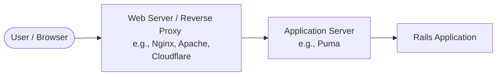

# Rails Application & Web Server Configuration Guide

This guide explains how to configure your Rails application server (**Puma**) and understand its relationship with web servers (like **Nginx** or platform routers like Render/Heroku) in development and production environments.

---

## 1. Application Server vs. Web Server

In a modern Rails deployment, web traffic goes through a two-tier architecture:



1.  **Web Server (Reverse Proxy)**: Examples include Nginx, Apache, or the routing layers of platforms like Render and Heroku.
    *   Handles SSL/TLS termination (HTTPS).
    *   Serves static assets (images, CSS, JS) directly, without hitting Rails.
    *   Gaurds against slow clients (buffering requests).
    *   Acts as a load balancer distributing traffic to application servers.
2.  **Application Server (Puma)**:
    *   A fast, concurrent Ruby web server designed specifically to run your Rack-based Rails application.
    *   It executes your Ruby code, queries the database, and returns the dynamically generated HTML/JSON.

---

## 2. Configuring Puma (`config/puma.rb`)

Puma uses a combination of **threads** and **processes (workers)** to handle concurrent requests.

### Threads vs. Workers (Processes)

*   **Threads** (Concurrency within a single process):
    *   Multiple threads share the same memory space.
    *   Highly efficient for **I/O-bound** operations (e.g., waiting for database queries, external API calls like Stripe).
    *   Limited by Ruby's **Global VM Lock (GVL)**, meaning only one thread can execute Ruby code at a single instant on a CPU core.
*   **Workers** (Clustered Mode / Multiple processes):
    *   Each worker is a separate operating system process with its own copy of your Rails application in memory.
    *   Allows true **parallelism** across multiple CPU cores (bypassing the GVL).
    *   Consumes significantly more memory.

### Configuring for Environments

Your `config/puma.rb` determines how Puma runs. Here is how to configure it:

#### A. Single Mode (Default / Development)
Runs a single process with a pool of threads. Best for development or low-memory servers (e.g., free/cheap hosting tiers).
```ruby
# config/puma.rb
threads_count = ENV.fetch("RAILS_MAX_THREADS", 3)
threads threads_count, threads_count

port ENV.fetch("PORT", 3000)
plugin :tmp_restart
```

#### B. Clustered Mode (Recommended for Production)
Runs multiple worker processes, each containing multiple threads.
```ruby
# config/puma.rb
# 1. Define threads per worker
threads_count = ENV.fetch("RAILS_MAX_THREADS", 5)
threads threads_count, threads_count

# 2. Define number of worker processes (usually matches CPU cores)
workers ENV.fetch("WEB_CONCURRENCY", 2)

# 3. Preload the application before booting workers (saves memory via Copy-on-Write)
preload_app!

port ENV.fetch("PORT", 3000)

# 4. Reconnect to database after workers fork
on_worker_boot do
  ActiveRecord::Base.establish_connection
end

plugin :tmp_restart
```

---

## 3. Database Connection Pool Warning ⚠️

If Puma is configured to use **5 threads**, your Rails application must have at least **5 database connections** available per process. Otherwise, threads will block waiting for a database connection, leading to timeouts.

Ensure your `config/database.yml` matches your Puma thread configuration:

```yaml
# config/database.yml
production:
  adapter: postgresql
  encoding: unicode
  # Ensure pool size is at least equal to RAILS_MAX_THREADS
  pool: <%= ENV.fetch("RAILS_MAX_THREADS", 5) %>
  database: <%= ENV.fetch("DATABASE_URL") %>
```

---

## 4. Production Web Server Setup (Nginx + Puma)

When deploying to your own Virtual Private Server (VPS) like DigitalOcean or AWS EC2, you typically set up **Nginx** in front of Puma. Nginx communicates with Puma via a Unix Socket or a TCP port.

### Example Nginx Configuration (`/etc/nginx/sites-available/my_app`)

```nginx
upstream app {
  # Path to Puma socket file
  server unix:///home/deploy/apps/my_app/shared/tmp/sockets/puma.sock fail_timeout=0;
}

server {
  listen 80;
  server_name mydomain.com;

  # Redirect HTTP to HTTPS
  return 301 https://$host$request_uri;
}

server {
  listen 443 ssl;
  server_name mydomain.com;

  # SSL Certificates
  ssl_certificate /etc/letsencrypt/live/mydomain.com/fullchain.pem;
  ssl_certificate_key /etc/letsencrypt/live/mydomain.com/privkey.pem;

  root /home/deploy/apps/my_app/current/public;

  try_files $uri/index.html $uri @app;

  location @app {
    proxy_pass http://app;
    proxy_set_header X-Forwarded-For $proxy_add_x_forwarded_for;
    proxy_set_header Host $http_host;
    proxy_redirect off;
  }

  # Serve static assets directly through Nginx
  location ~ ^/(assets|packs|packs-test)/ {
    gzip_static on;
    expires max;
    add_header Cache-Control public;
  }
}
```

---

## 5. Cloud/PaaS Platforms (Render, Heroku)

If you are deploying to platforms like **Render** (as indicated by your `render.yaml` file):
*   **You do not need to configure Nginx.** The platform automatically provides a routing layer that handles SSL termination, static asset routing, and forwards requests to your Puma server.
*   You only need to set the environment variables:
    *   `PORT` (usually set automatically by the platform)
    *   `RAILS_MAX_THREADS` (typically `5`)
    *   `WEB_CONCURRENCY` (typically `2` or more depending on your plan's CPU/Memory)

---

## 6. Redirecting Non-WWW to WWW (e.g., `example.com` $\rightarrow$ `www.example.com`)

Forcing a redirect from your root domain (`example.com`) to your `www` subdomain (`www.example.com`) is a common requirement. It is best to handle this **before** the request reaches your Rails application.

Here are the three most common ways to configure this:

### Method A: At the DNS/Provider Level (Highly Recommended)
Most DNS and domain providers (Cloudflare, Namecheap, GoDaddy, Route53) allow you to set up redirection rules directly on their edge servers. This is the fastest method because the redirect happens before reaching your actual web server.

1.  **Cloudflare**: 
    *   Go to **Rules** $\rightarrow$ **Redirect Rules** $\rightarrow$ **Create Rule**.
    *   If incoming request URL matches `example.com`, redirect to `https://www.example.com` (Type: *301 Permanent*).
2.  **Namecheap / GoDaddy**:
    *   Go to Domain Settings $\rightarrow$ **Redirect Domain** (or **Domain Forwarding**).
    *   Set source as `example.com` and destination as `https://www.example.com`.

---

### Method B: In your Nginx Configuration (If using a VPS)
If you manage your own Nginx web server, you can add a dedicated server block that catches the non-www traffic and redirects it.

Modify your Nginx configuration file:

```nginx
# 1. Catch non-www (HTTP & HTTPS) and redirect to www
server {
    listen 80;
    listen 443 ssl;
    server_name example.com;

    # Include SSL certificates here if listening on 443
    ssl_certificate /etc/letsencrypt/live/example.com/fullchain.pem;
    ssl_certificate_key /etc/letsencrypt/live/example.com/privkey.pem;

    # 301 Permanent Redirect to www
    return 301 https://www.example.com$request_uri;
}

# 2. Main server block for www.example.com
server {
    listen 443 ssl;
    server_name www.example.com;

    ssl_certificate /etc/letsencrypt/live/example.com/fullchain.pem;
    ssl_certificate_key /etc/letsencrypt/live/example.com/privkey.pem;

    # Your actual Rails/Puma configuration goes here...
    root /home/deploy/apps/my_app/current/public;
    ...
}
```

#### How to apply this to your Server:
When you are ready to deploy, log into your production server via SSH and perform the following steps:

1.  **Copy the configuration file** to Nginx's configurations folder on your server:
    ```bash
    sudo cp /path/to/your/app/config/nginx.conf /etc/nginx/sites-available/chetu_blog
    ```
2.  **Enable the site** by creating a symbolic link to the `sites-enabled` folder:
    ```bash
    sudo ln -sf /etc/nginx/sites-available/chetu_blog /etc/nginx/sites-enabled/chetu_blog
    ```
3.  **Test the configuration** for syntax errors:
    ```bash
    sudo nginx -t
    ```
4.  **Restart Nginx** to apply the changes:
    ```bash
    sudo systemctl restart nginx
    ```

---


### Method C: On Render (If using `render.yaml`)
If you are deploying to Render, Render handles this automatically when you define your custom domains.

1.  Add both domains (`example.com` and `www.example.com`) to your Render service.
2.  In the Render Dashboard, go to your service $\rightarrow$ **Settings** $\rightarrow$ **Custom Domains**.
3.  Set `www.example.com` as the **Primary** domain.
4.  Render will automatically redirect all traffic from `example.com` to `www.example.com` with a 301 redirect.
